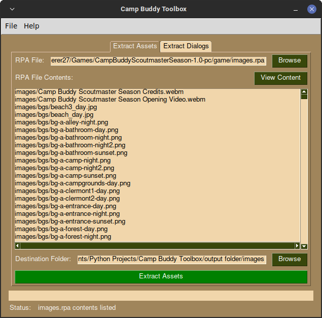

[](https://www.gnu.org/licenses/gpl-3.0)

<!-- PROJECT LOGO -->
<br />
<div align="center">
  <a href="https://github.com/othneildrew/Best-README-Template">
    
  </a>

  <h3 align="center">Camp Buddy Toolbox</h3>

  <p align="center">
    An application that allows you to extract assets and character dialogs of Camp Buddy easily!
    Built With [PySimpleGUI](https://pysimplegui.readthedocs.io/en/latest/)
    <br />
    <a href="https://github.com/othneildrew/Best-README-Template"><strong>Explore the docs »</strong></a>
    <br />
    <br />
    <a href="https://github.com/othneildrew/Best-README-Template">View Demo</a>
    ·
    <a href="https://github.com/othneildrew/Best-README-Template/issues">Report Bug</a>
    ·
    <a href="https://github.com/othneildrew/Best-README-Template/issues">Request Feature</a>
  </p>
</div>

<!-- ABOUT THE PROJECT -->
## About The Project

<div align="center">
  
</div>

<br>

There are many great RPA Extractors on GitHub; one of them is <a href="https://github.com/Lattyware/unrpa">UnRPA</a>. And once upon a time, I wanted to create a Discord chatbot that speaks exactly like Keitaro, however, none have written a dialog extractor specifically for Camp Buddy, so I wrote one <a href="https://github.com/lonewanderer27/Camp-Buddy-Dialog-Extractor">here</a>.

But still both of these tools are command line interface apps, meaning a user would have to know how to use a terminal which is not user friendly...
So I thought to myself.. why not combine these tools (and more that I can think of in the future) into an easy to use application?

Features:
* Preview and Extract the contents of an RPA file
* Extract dialogs of Camp Buddy characters onto a CSV file that can be used to make a Discord chatbot

<p align="right">(<a href="#top">back to top</a>)</p>


### Installation

TODO
   ```

<p align="right">(<a href="#top">back to top</a>)</p>


<!-- USAGE EXAMPLES -->
## Usage

TODO

<p align="right">(<a href="#top">back to top</a>)</p>


<!-- ROADMAP -->
## Roadmap

- [x] List RPA Files
- [x] Extract Dialog Lines
- [ ] Search function in listing the RPA file contents
- [ ] Choose what contents in the RPA file should be extracted
- [ ] Use the QT Port of PySimpleGUI

<p align="right">(<a href="#top">back to top</a>)</p>


<!-- CONTRIBUTING -->
## Contributing

Contributions are what make the open source community such an amazing place to learn, inspire, and create. Any contributions you make are **greatly appreciated**.

If you have a suggestion that would make this better, please fork the repo and create a pull request. You can also simply open an issue with the tag "enhancement".
Don't forget to give the project a star! Thanks again!

1. Fork the Project
2. Create your Feature Branch (`git checkout -b feature/AmazingFeature`)
3. Commit your Changes (`git commit -m 'Add some AmazingFeature'`)
4. Push to the Branch (`git push origin feature/AmazingFeature`)
5. Open a Pull Request

<p align="right">(<a href="#top">back to top</a>)</p>


<!-- LICENSE -->
## License

Camp Buddy Toolbox is distributed under the The GNU General Public License v3.0. See `COPYING` for more information.

<p align="right">(<a href="#top">back to top</a>)</p>


<!-- CONTACT -->
## Contact

Adriane James - adrianejames27@gmail.com

Project Link: [https://github.com/lonewanderer27/Camp-Buddy-Toolbox](https://github.com/lonewanderer27/Camp-Buddy-Toolbox)

<p align="right">(<a href="#top">back to top</a>)</p>


<!-- ACKNOWLEDGMENTS -->
## Acknowledgments

* [rpatool](https://github.com/Shizmob/rpatool)
* [unrpa](https://github.com/Lattyware/unrpa)
* [PySimpleGUI](https://github.com/PySimpleGUI/PySimpleGUI)
* [Font Awesome](https://fontawesome.com)
* [Best README Template](https://github.com/othneildrew/Best-README-Template)
* [GitHub Pages](https://pages.github.com)
* [GNOME](https://www.gnome.org/)

<p align="right">(<a href="#top">back to top</a>)</p>
