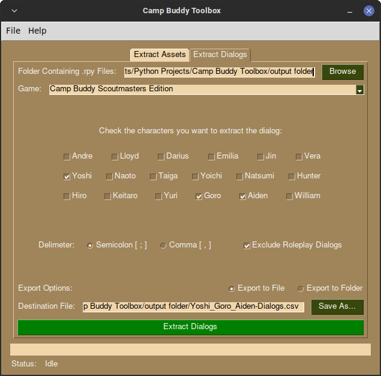

[](https://www.gnu.org/licenses/gpl-3.0)

<!-- PROJECT LOGO -->
<br />
<div align="center">
  <a href="https://github.com/lonewanderer27/Camp-Buddy-Toolbox">
    
  </a>

  <h3 align="center">Camp Buddy Toolbox</h3>

  <p align="center">
    An application that allows you to extract assets and character dialogs of Camp Buddy easily!
    <br />
    Built with <a href="https://github.com/PySimpleGUI/PySimpleGUI">PySimpleGUI</a>
    <br />
    <br />
    <a href="#demo">View Demo</a>
    ·
    <a href="https://github.com/lonewanderer27/Camp-Buddy-Toolbox/issues">Report Bug</a>
    ·
    <a href="https://github.com/lonewanderer27/Camp-Buddy-Toolbox/issues">Request Feature</a>
    ·
    <a href="#legal">Legal Notice</a>
  </p>
</div>

<!-- ABOUT THE PROJECT -->
## About The Project

<div align="center">
  
</div>

<br>

I once wanted to create a Discord chatbot that speaks exactly like Keitaro, however, none have written a dialog extractor specifically for Camp Buddy, so I wrote one <a href="https://github.com/lonewanderer27/Camp-Buddy-Dialog-Extractor">here</a>.

However, that program is a command line application, meaning a user would have to know how to use a terminal which is not very user friendly... What if someone who's inexperienced in coding just wants to have fun with their friends, talking to Keitaro or Hiro in their Discord server, like I once wanted...

So I thought to myself.. why not make an app that can extract scripts from Camp Buddy? (and more that I can think of in the future)

#### Features:
* Preview and Extract the contents of any RPA file
* Extract dialogs of Camp Buddy characters and export it to a CSV file to make a Discord chatbot

<p align="right">(<a href="#top">back to top</a>)</p>


### Installation

#### For Windows:
1. Go to Releases page in this GitHub repository (it should be at the right side of the website).
2. On the latest release, click the Camp_Buddy_Toolbox_Windows.exe to download it.
3. Double click to run the program.

#### For Linux:
1. Go to Releases page in this GitHub repository (it should be at the right side of the website).
2. On the latest release, click the Camp_Buddy_Toolbox_Linux to download it.
3. Make it executable: ```chmod +x ./Camp_Buddy_Toolbox_Linux```
4. Double click to run the program.

#### For Mac:
- I don't have a Mac, however, I'm open to someone who wants to volunteer to help fix bugs and compile Camp Buddy Toolbox on MacOS.

<p align="right">(<a href="#top">back to top</a>)</p>


<!-- DEMO EXAMPLES -->
## Demo
<div id='demo'>
  
### Extracting contents of scripts.rpa
https://user-images.githubusercontent.com/28822916/173348423-adfa8c08-5210-4db3-8092-12450c5e49a8.mp4

### Extracting dialog lines of Aiden, Yoshi and Goro
https://user-images.githubusercontent.com/28822916/173348825-94f67632-47b6-4280-95c3-df35bab43691.mp4

### Extracting dialong lines of Lloyd, Darius, Hyunjin and Yuri
https://user-images.githubusercontent.com/28822916/173349062-0bcdaf72-1724-4ccd-9fea-ab149ff95784.mp4

<p align="right">(<a href="#top">back to top</a>)</p>
</div>


<!-- ROADMAP -->
## Roadmap

- [x] List RPA Files
- [x] Extract Dialog Lines
- [ ] Selectively choose what contents in the RPA file should be extracted
- [ ] Search the contents of an RPA file
- [ ] Use the QT Port of PySimpleGUI
- [ ] Release compiled executable for Windows and Mac (hopefully)

<p align="right">(<a href="#top">back to top</a>)</p>


<!-- CONTRIBUTING -->
## Contributing

Contributions are what make the open source community such an amazing place to learn, inspire, and create. Any contributions you make are **greatly appreciated**.

If you have a suggestion that would make this better, please fork the repo and create a pull request. You can also simply open an issue with the tag "enhancement".
Don't forget to give the project a star! Thanks again!

1. Fork the Project
2. Create your Feature Branch (`git checkout -b feature/AmazingFeature`)
3. Commit your Changes (`git commit -m 'Add some AmazingFeature'`)
4. Push to the Branch (`git push origin feature/AmazingFeature`)
5. Open a Pull Request

<p align="right">(<a href="#top">back to top</a>)</p>


<!-- LICENSE -->
## License

Camp Buddy Toolbox is free software: you can redistribute it and/or modify it under the terms of the GNU General Public License as published by the Free Software Foundation, either version 3 of the License, or (at your option) any later version.

Camp Buddy Toolbox is distributed in the hope that it will be useful, but WITHOUT ANY WARRANTY; without even the implied warranty of MERCHANTABILITY or FITNESS FOR A PARTICULAR PURPOSE. See the GNU General Public License for more details.

You should have received a copy of the GNU General Public License along with this program. If not, see <https://www.gnu.org/licenses/>.

<p align="right">(<a href="#top">back to top</a>)</p>


<!-- LEGAL NOTICE -->
## Legal Notice
                                
<div id="legal">
I created this program for you, as a fan of Camp Buddy, to create your own Discord Chatbot and perhaps also look at the assets yourself. However having the tool doesn't mean you have the right to share any assets generated by this program including images, scripts, audios to others online (especially the ones who did not even paid for the game) without permission from the author.

By doing so, you're infringing on BLits Games Intellectual Property and you are subject to legal repercussions!

<p align="right">(<a href="#top">back to top</a>)</p>
</div>


<!-- CONTACT -->
## Contact

Adriane James - adrianejames27@gmail.com

Project Link: [https://github.com/lonewanderer27/Camp-Buddy-Toolbox](https://github.com/lonewanderer27/Camp-Buddy-Toolbox)

<p align="right">(<a href="#top">back to top</a>)</p>


<!-- ACKNOWLEDGMENTS -->
## Acknowledgments

#### Camp Buddy Toolbox wouldn't be possible if it weren't for these amazing projects:
* [rpatool](https://github.com/Shizmob/rpatool)   
* [unrpa](https://github.com/Lattyware/unrpa)
* [PySimpleGUI](https://github.com/PySimpleGUI/PySimpleGUI)
* [Font Awesome](https://fontawesome.com)
* [Best README Template](https://github.com/othneildrew/Best-README-Template)
* [GNOME](https://www.gnome.org/)

<p align="right">(<a href="#top">back to top</a>)</p>
